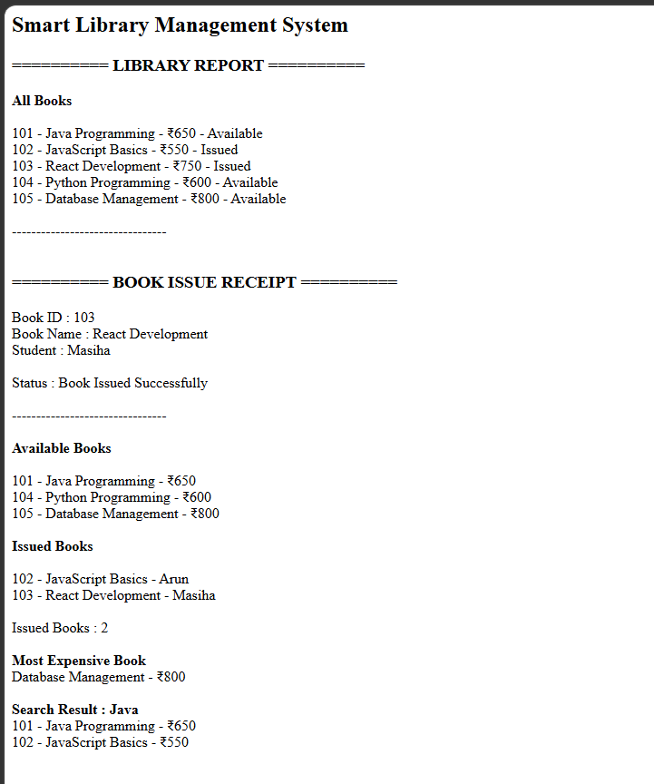

# Day 48 - JavaScript Smart Library Management System

## Overview

Created a Smart Library Management System using HTML and JavaScript to manage books, issue and return books, search for books, track issued books, and identify the most expensive book.

## Topics Covered

- JavaScript Classes
- Constructor and Objects
- Arrays
- Loops
- Conditional Statements
- Library Management
- Book Issue and Return
- Book Search
- Status Tracking
- DOM Manipulation

## Technologies Used

- HTML5
- JavaScript

## Practice

Performed the following operations:

- Stored book details
- Displayed all books
- Checked book availability
- Issued a book to a student
- Returned an issued book
- Displayed available books
- Displayed issued books
- Counted issued books
- Found the most expensive book
- Searched books using keywords
- Displayed the library report

## JavaScript Concepts Used

- `class`
- `constructor()`
- `this`
- Arrays
- `for` loop
- `if-else`
- Object Literals
- Functions
- `toLowerCase()`
- `includes()`
- Template Literals
- `getElementById()`
- `innerHTML`

## Output

## Learning Outcome

Learned how to build a library management system using JavaScript classes, arrays, loops, conditional statements, book issue and return operations, searching, and status tracking.
