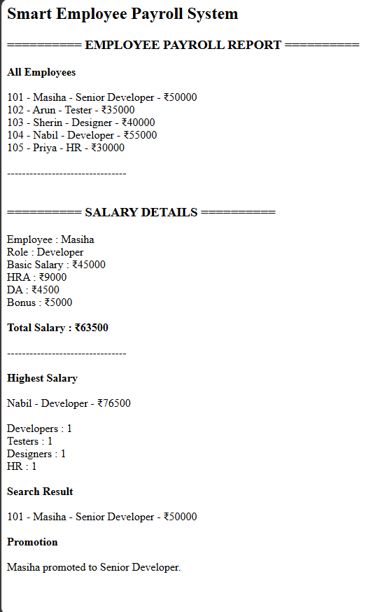

# Day 49 - JavaScript Smart Employee Payroll System

## Overview

Created a Smart Employee Payroll System using HTML and JavaScript to manage employee details, calculate salaries, track departments, search employees, and handle promotions.

## Topics Covered

- JavaScript Classes
- Constructor and Objects
- Arrays
- Loops
- Conditional Statements
- Salary Calculation
- Employee Management
- Search Operations
- DOM Manipulation

## Technologies Used

- HTML5
- JavaScript

## Practice

Performed the following operations:

- Stored employee details
- Displayed all employees
- Calculated salary with HRA, DA, and bonus
- Found the highest salary
- Counted employees by role
- Searched employees by name
- Promoted an employee
- Updated salary after promotion

## JavaScript Concepts Used

- `class`
- `constructor()`
- `this`
- Arrays
- `for` loop
- `if-else`
- Object Literals
- Functions
- `toLowerCase()`
- `includes()`
- `getElementById()`
- `innerHTML`

## Output

## Learning Outcome

Learned how to build an employee payroll system using JavaScript classes, arrays, salary calculations, loops, search operations, and conditional statements.
