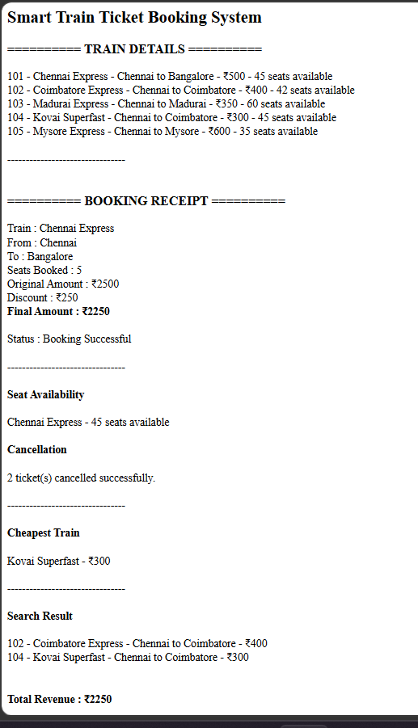

# Day 50 - JavaScript Smart Train Ticket Booking System

## Overview

Created a Smart Train Ticket Booking System using HTML and JavaScript to manage train details, ticket booking, seat availability, cancellations, train search, and revenue tracking.

## Topics Covered

- JavaScript Classes
- Constructor and Objects
- Arrays
- Loops
- Conditional Statements
- Ticket Booking
- Seat Management
- Discount Calculation
- Train Search
- Revenue Calculation
- DOM Manipulation

## Technologies Used

- HTML5
- JavaScript

## Practice

Performed the following operations:

- Stored train details
- Displayed available trains
- Booked train tickets
- Calculated ticket amount and discount
- Updated available seats
- Cancelled tickets
- Checked seat availability
- Found the cheapest train
- Searched trains by location
- Calculated total revenue
- Displayed booking receipt

## JavaScript Concepts Used

- `class`
- `constructor()`
- `this`
- Arrays
- `for` loop
- `if-else`
- Object Literals
- Functions
- `toLowerCase()`
- Template Literals
- `getElementById()`
- `innerHTML`

## Output

## Learning Outcome

Learned how to build a train ticket booking system using JavaScript classes, arrays, loops, seat management, discount calculation, search operations, and revenue tracking.
