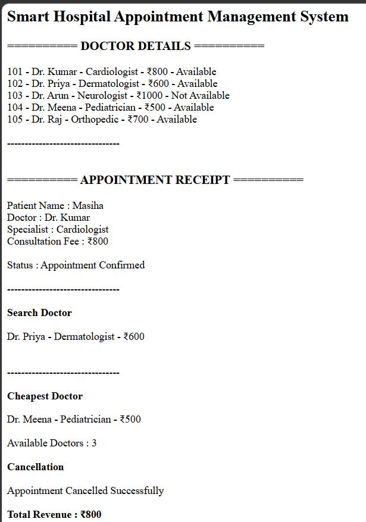

# Day 51 - JavaScript Smart Hospital Appointment Management System

## Overview

Created a Smart Hospital Appointment Management System using HTML and JavaScript to manage doctors, appointments, cancellations, doctor search, availability, and revenue tracking.

## Topics Covered

- JavaScript Classes
- Constructor and Objects
- Arrays
- Loops
- Conditional Statements
- Appointment Management
- Doctor Search
- Availability Tracking
- Revenue Calculation
- DOM Manipulation

## Technologies Used

- HTML5
- JavaScript

## Practice

Performed the following operations:

- Stored doctor details
- Displayed doctor information
- Checked doctor availability
- Booked appointments
- Generated appointment receipts
- Cancelled appointments
- Searched doctors by specialization
- Found the cheapest doctor
- Counted available doctors
- Calculated total revenue

## JavaScript Concepts Used

- `class`
- `constructor()`
- `this`
- Arrays
- `for` loop
- `if-else`
- Object Literals
- Functions
- `toLowerCase()`
- `includes()`
- Template Literals
- `getElementById()`
- `innerHTML`

## Output

## Learning Outcome

Learned how to build a hospital appointment management system using JavaScript classes, arrays, loops, conditional statements, search operations, availability tracking, and revenue calculation.
