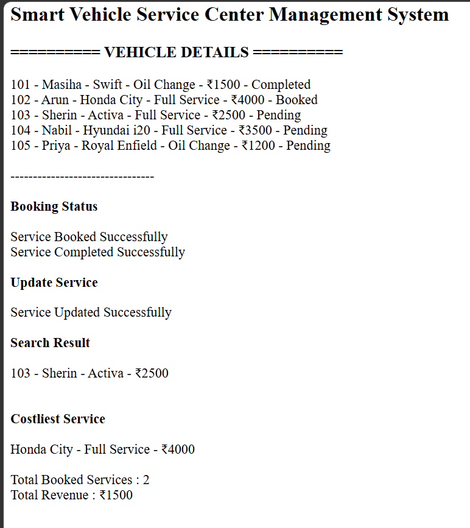

# Day 52 - JavaScript Smart Vehicle Service Center Management System

## Overview

Created a Smart Vehicle Service Center Management System using HTML and JavaScript to manage vehicle services, bookings, service completion, vehicle search, and revenue tracking.

## Topics Covered

- JavaScript Classes
- Constructor and Objects
- Arrays
- Loops
- Conditional Statements
- Service Booking and Management
- Vehicle Search
- Service Cost Calculation
- Status Tracking
- Revenue Calculation
- DOM Manipulation

## Technologies Used

- HTML5
- JavaScript

## Practice

Performed the following operations:

- Stored vehicle and service details
- Displayed vehicle information
- Booked vehicle services
- Completed services and updated status
- Updated service type and cost
- Searched vehicles by owner name
- Found the costliest service
- Counted booked and completed services
- Calculated total revenue

## JavaScript Concepts Used

- `class`
- `constructor()`
- `this`
- Arrays
- `for` loop
- `if-else`
- Logical Operators
- Object Literals
- Functions
- `toLowerCase()`
- `includes()`
- `getElementById()`
- `innerHTML`

## Output

## Learning Outcome

Learned how to manage vehicle service bookings, update service statuses, search vehicle records, calculate service costs, and track revenue using JavaScript classes, arrays, loops, and conditional statements.
