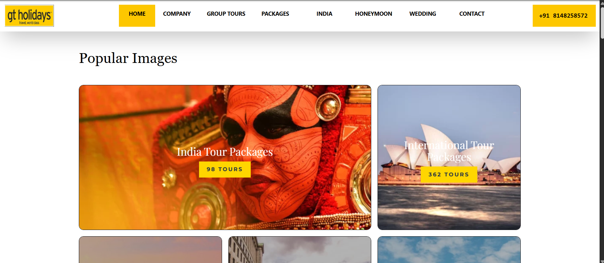
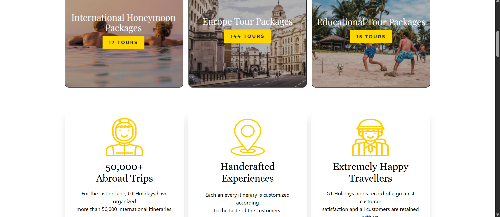
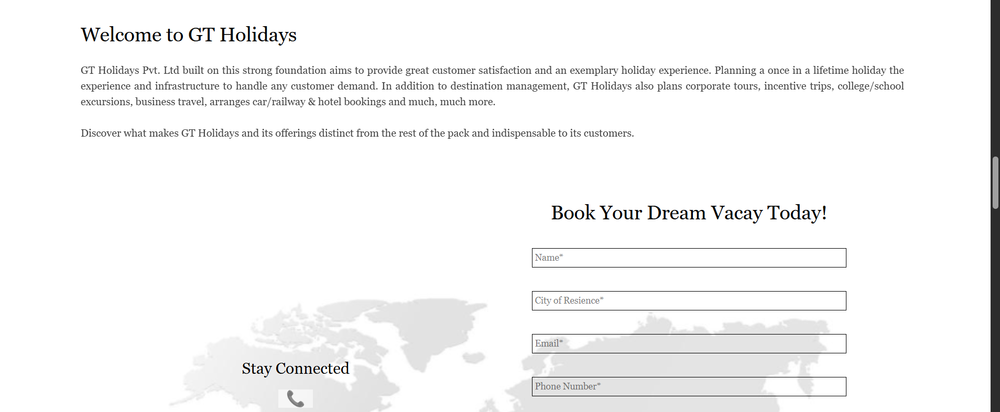
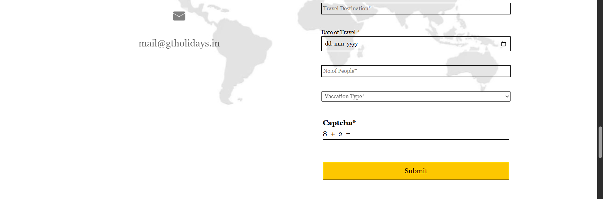
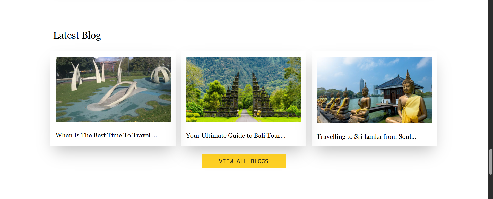
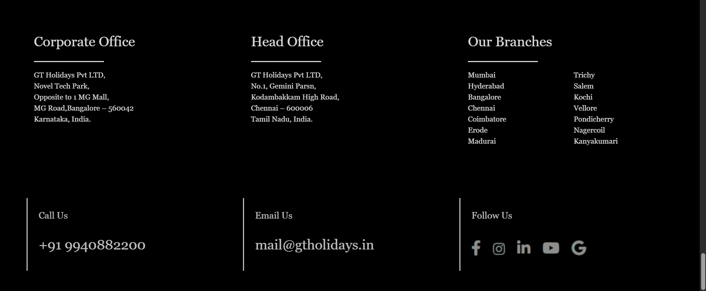

# Day-03 - Tailwind CSS

## Overview
Practiced Tailwind CSS by creating a complete travel website for GT Holidays. Applied utility classes to design the navigation bar, image gallery, travel highlights, booking form, testimonials, blog section, subscription area, and footer.

## Topics Covered
- Tailwind CSS CDN
- Grid Layout
- Grid Columns
- Gap and Spacing
- Padding and Margin
- Text Styling
- Font Families
- Background Colors
- Borders and Border Radius
- Box Shadows
- Image Styling
- Form Styling
- Input Fields
- Select Dropdown
- Buttons
- Responsive Utility Classes

## Technologies Used
- HTML5
- Tailwind CSS

## Practice
Created a complete travel website using Tailwind CSS utility classes. Designed different sections including popular images, travel statistics, a booking form, customer testimonials, latest blogs, newsletter subscription, and a detailed footer.

## Output

### Output

