# Day-04 - Tailwind CSS

## Overview

Started learning Tailwind CSS by creating a complete ice cream website layout. Practiced utility-first styling, responsive classes, grid layouts, spacing, colors, typography, borders, shadows, positioning, and component-style sections.

## Topics Covered

* Tailwind CSS Setup
* Utility-First CSS
* Colors
* Typography
* Width and Height
* Margin and Padding
* Grid Layout
* Responsive Design
* Positioning
* Borders and Border Radius
* Shadows
* Background Images
* Object Fit
* Flexbox and Grid Utilities
* Form Styling
* Hover Effects

## Technologies Used

* HTML5
* Tailwind CSS

## Practice

Created a **Maharaja Ice Cream** webpage using Tailwind CSS. Practiced building a navigation bar, hero section, welcome section, service cards, about section, product menu, image gallery, contact form, map section, and footer.

## Key Tailwind Concepts Practiced

* `bg-*` for backgrounds
* `text-*` for colors and typography
* `p-*` and `m-*` for spacing
* `grid` and `grid-cols-*` for layouts
* `rounded-*` for rounded corners
* `shadow-*` for shadows
* `absolute` and `fixed` for positioning
* `hover:*` for hover effects
* `hidden` and responsive utility classes
* Arbitrary values such as `w-[...]` and `ml-[...]`

## Output

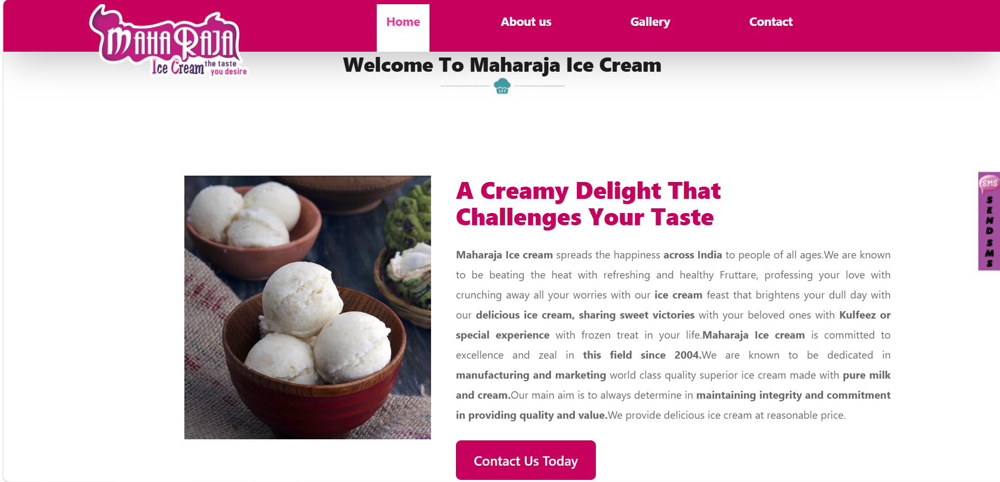
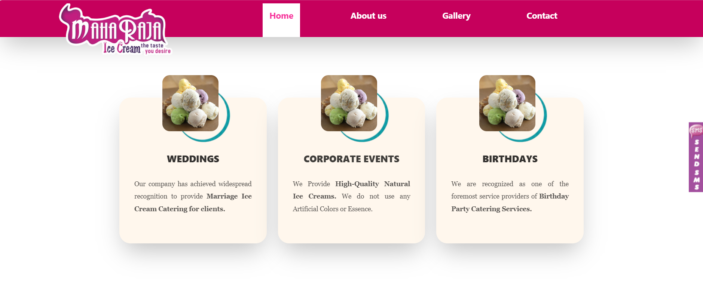
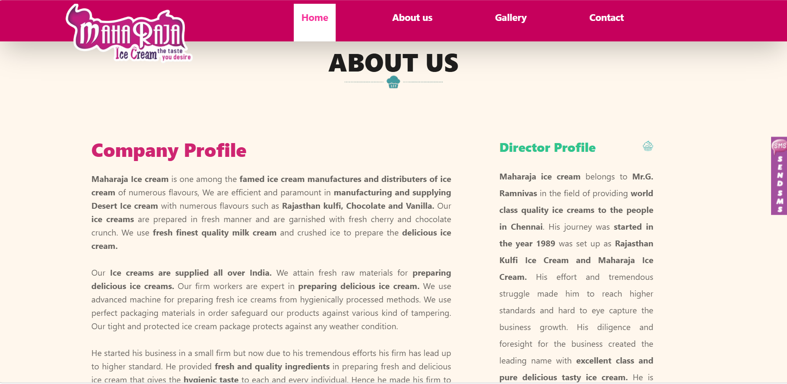
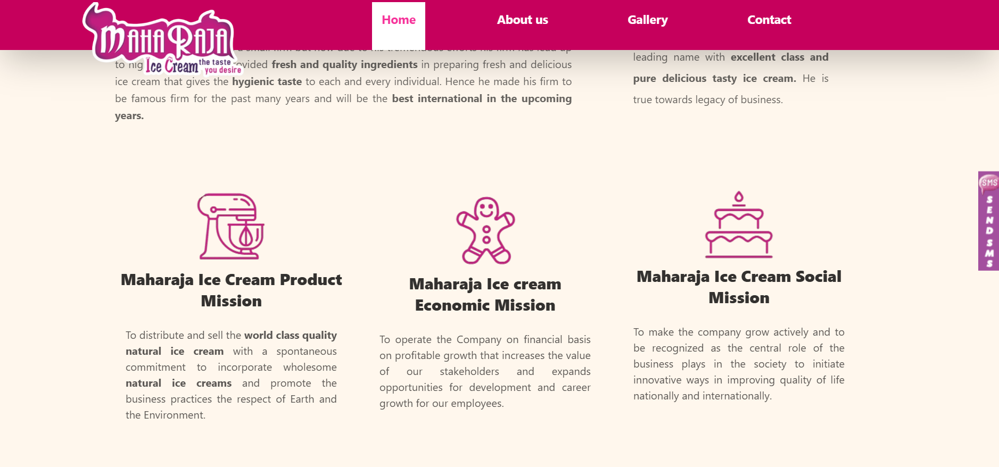
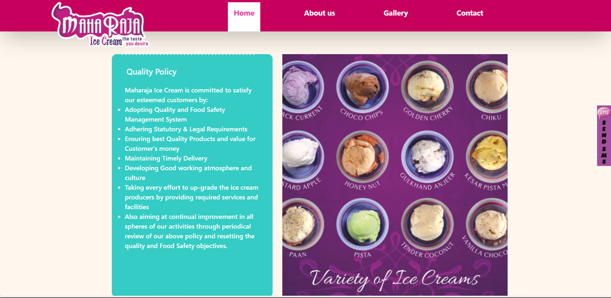
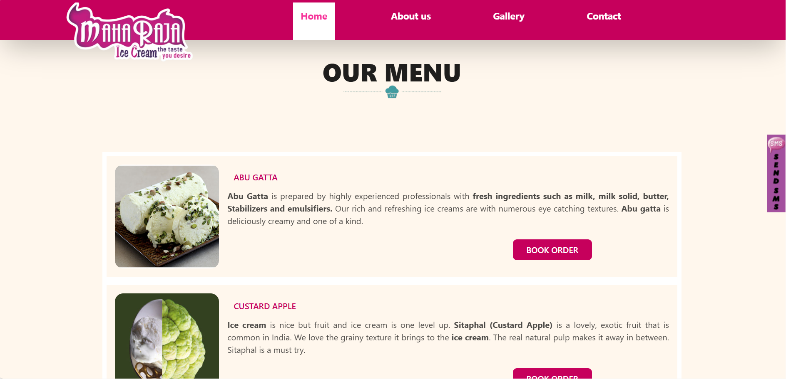
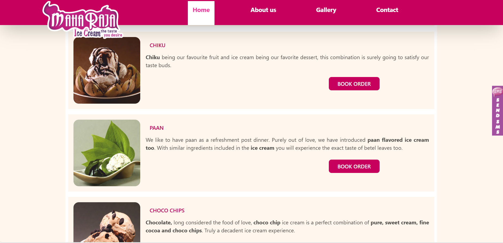
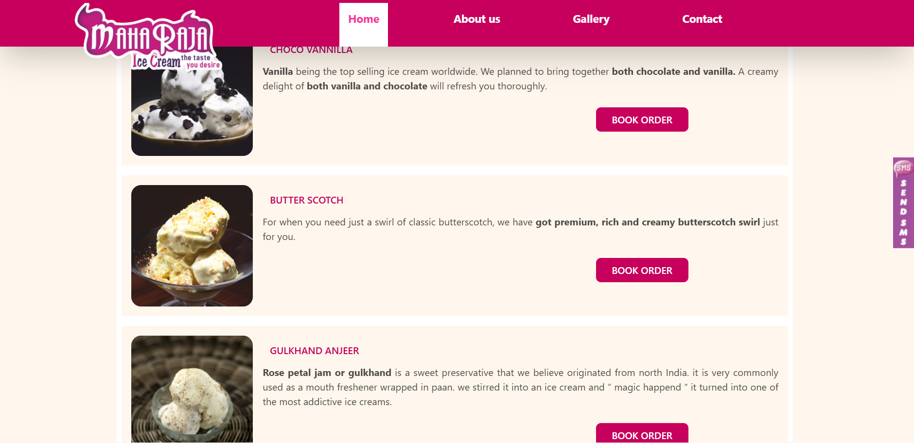
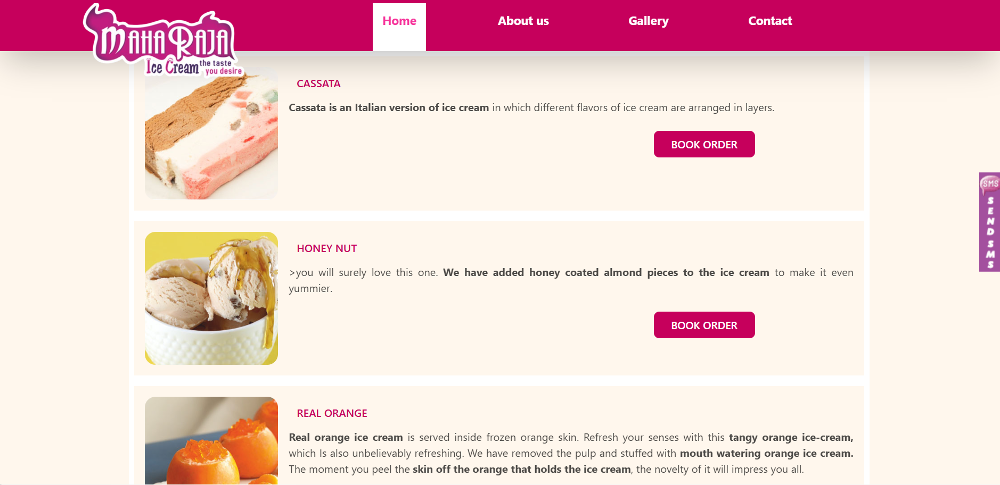
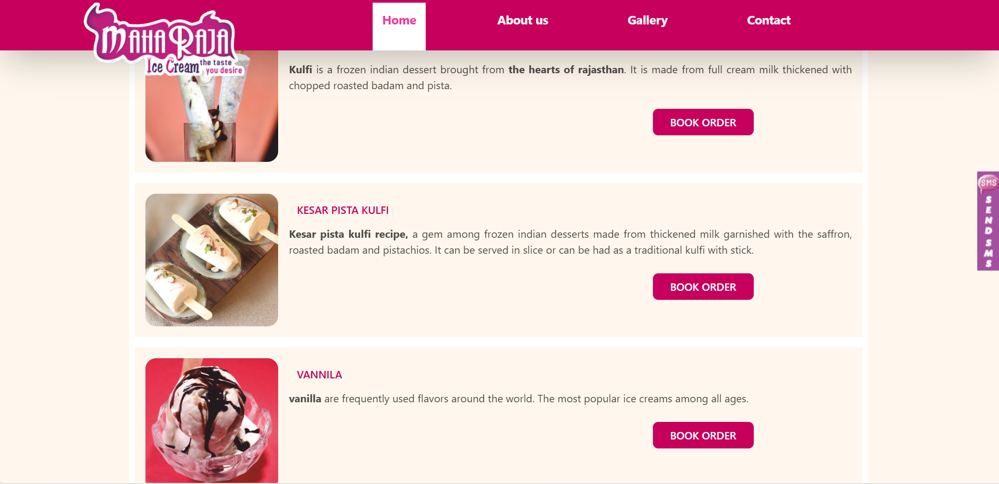
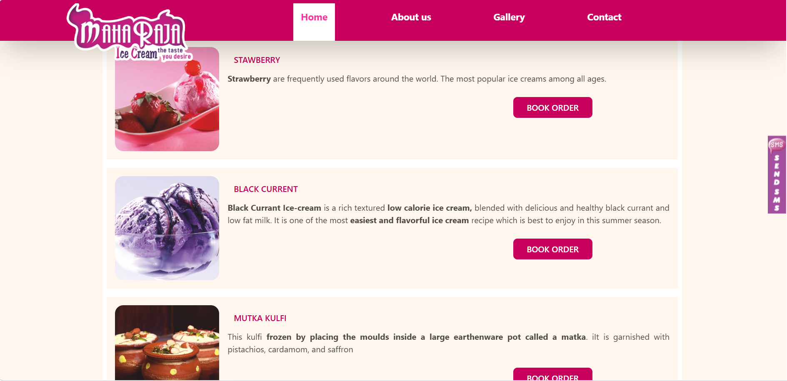
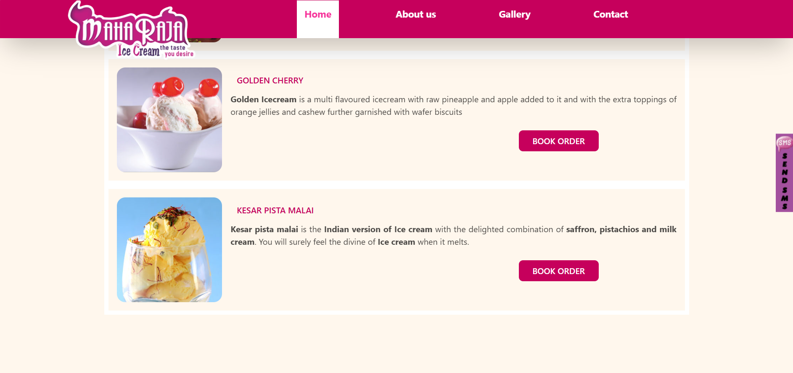
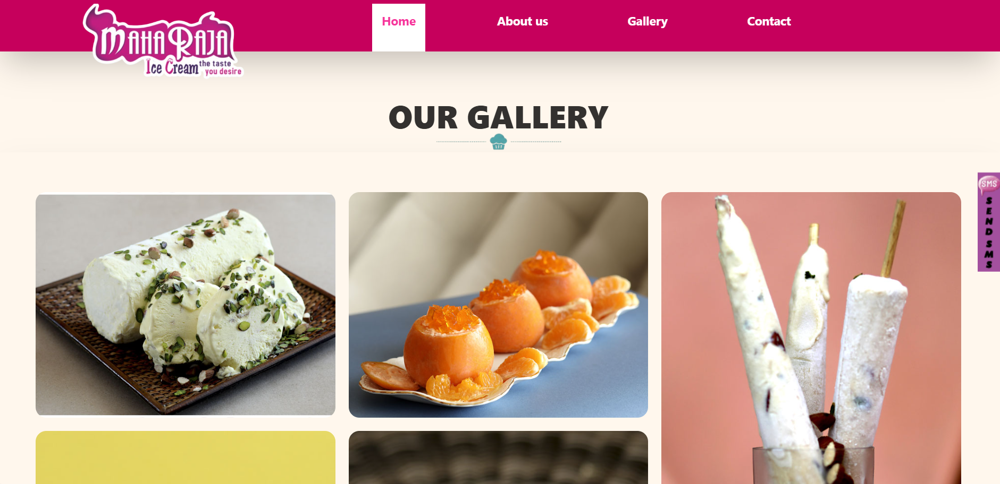
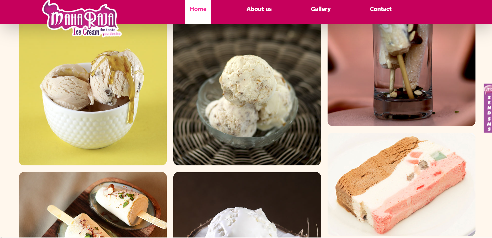
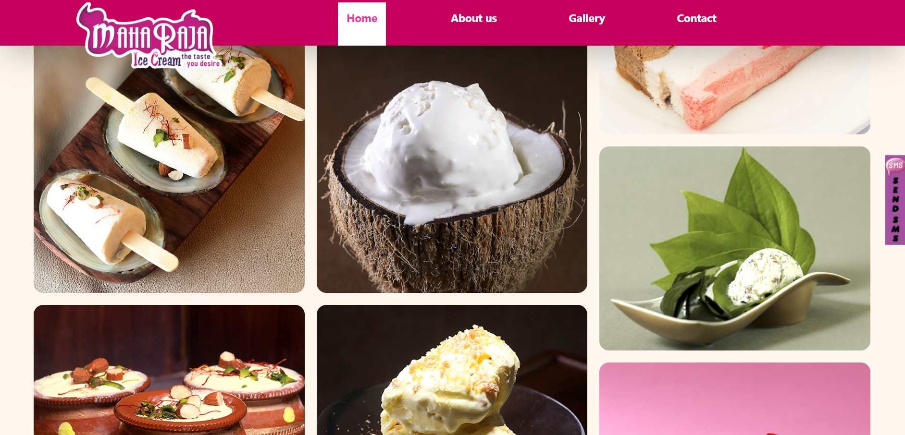
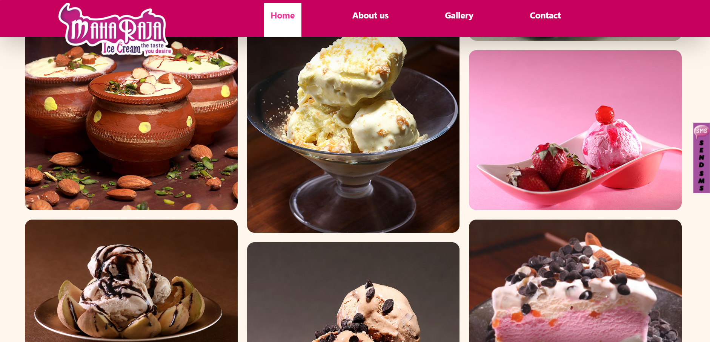
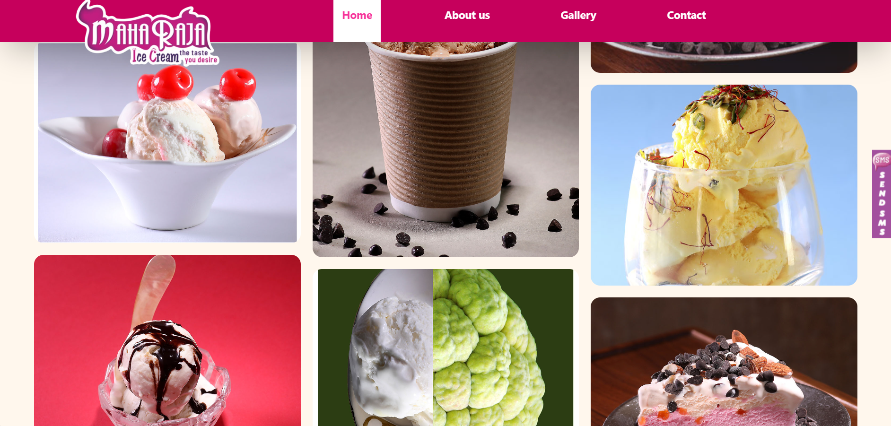
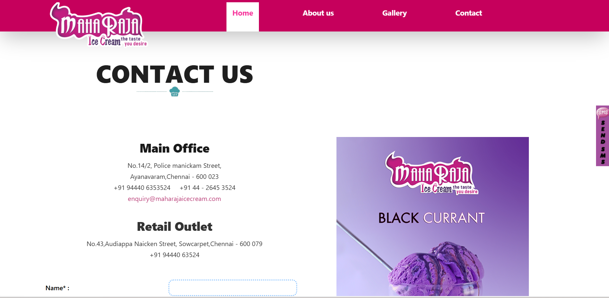
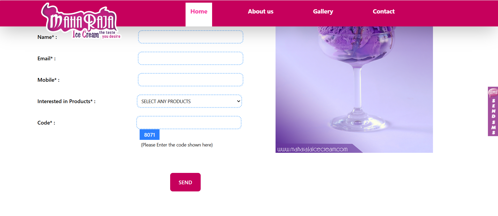
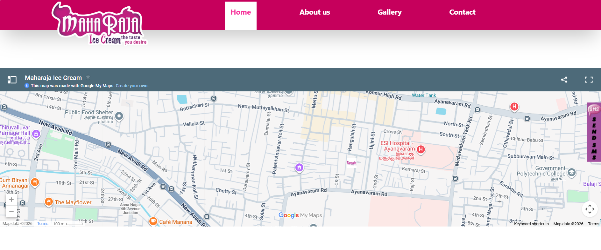
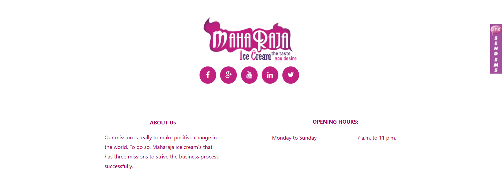
